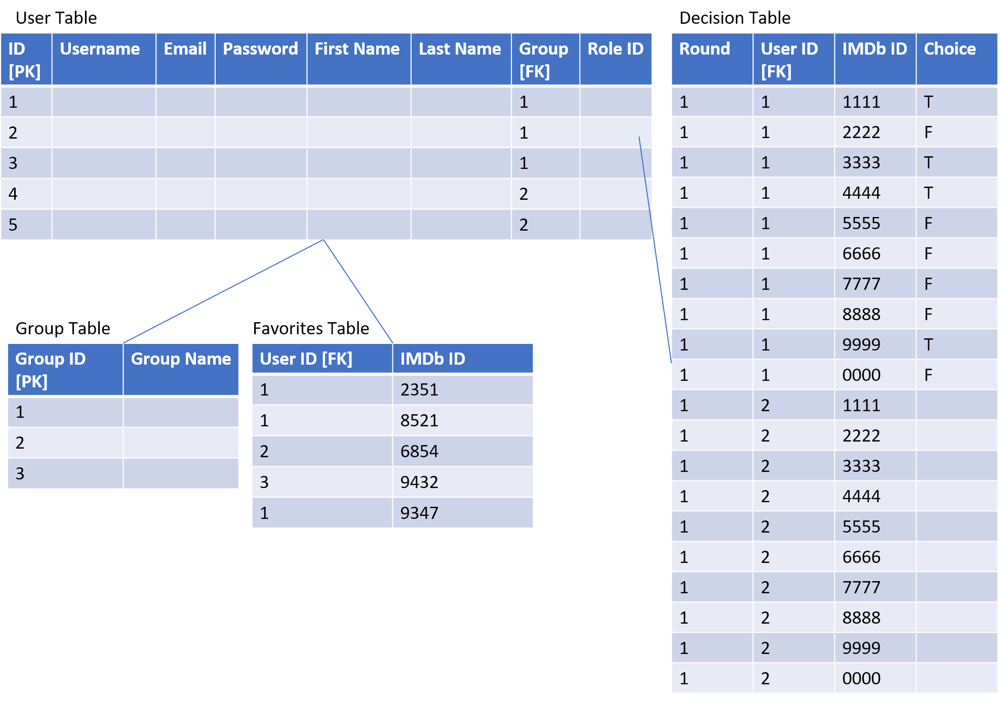

# Project2-BackEnd-JavaBeans

## Project upNext Vanquish Java Beans

---

An indecisive group of USERS would like the decision of what movie/show to watch tonight to be taken out of their hands. upNext will provide them with a database of movies/shows and serve to them random options that they are able to anonymously choose from individually until there is a mutual choice between members.

**Use Case Diagram**

**Database Schema**

### Requirements

---

## Users can:

- Register

- Login/Logout

- Update their information

- Users will be served a selection of movies/shows through the ImDb API

- Requirement 1: Users can search for and favorite movies

- Requirement 2: Join a group with other users of their choice

- Requirement 3: vote on movies inside of groups

- Requirement 4: perform logic to decide most voted on movie and display the winner

## Technologies Used:

- PostgreSQL
- dBeaver
- AWS RDS 
- Java 1.8
- Spring Data/MVC
- Postman
- Angular 13.1.1
- TypeScript
- HTML5
- CSS
- Bootstrap 5.1
- ImDb API
