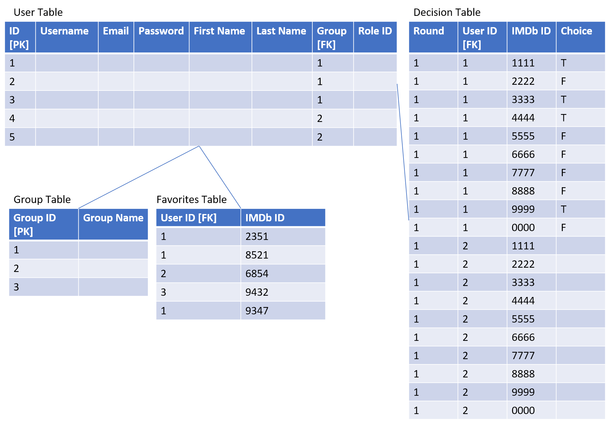

# Project2-BackEnd-JavaBeans

## Project upNext Vanquish Java Beans

---

An indecisive group of USERS would like the decision of what movie/show to watch tonight to be taken out of their hands. upNext will provide them with a database of movies/shows and serve to them random options that they are able to anonymously choose from individually until there is a mutual choice between members.

**Use Case Diagram**

**Database Schema**

### Requirements

---

- Users can

- Register.

- Login/Logout.

- Update their information.

- Users will be served a selection of movies/shows through the imdb api

- Requirement 1: Join a group with other users of their choice

- Requirement 2: vote on movies/shows

- Requirement 3: Track new releases

- Requirement 4 Filter by genre or streaming service

- Stretch Goal: use Utelly api to serve list of streaming services offering agreed upon movie
